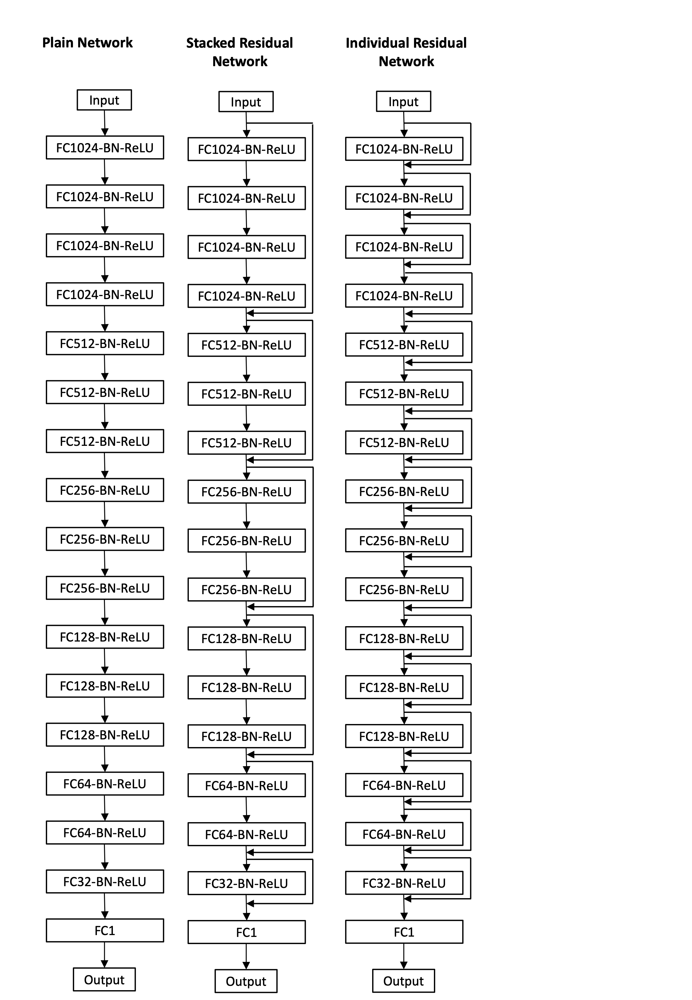

# IRNet

IRNet is a general purpose deep residual regression framework that contains model architectures composed of fully connected layers of different depths (17-layers, 24-layers and 48-layers) for data mining problems with numerical vectors as inputs.

  

## Installation Requirements

The basic requirement for re-using these environments are a Python 3 Jupyter environment with the packages listed in `requirements.txt`.

## Source Files

* `data_preprocess.ipynb`: Jupyter notebook that illustrates how to preprocess data for model training. It uses the oqmd-c.csv dataset (OQMD-C from paper) as sample, other datasets are pubicly available from OQMD and the Materials Project websites, and can be similarly preprocessed. Please run this with the respective data file to create the training and test/validation sets before running the model if you want to use physical attributes as the model input. The models can be trained using any vector input and a regression output.

* `dl_regressors.py`: Code to run any model for training.

* `data_utils.py`: Utility code for data loading.

* `train_utils.py`: Utility code for training the model.

* `sample`: A sample run folder that contains running configuration and a 17-layered IRNet model trained using random split of a subset from `oqmd-c.csv` in `training-data` folder.

## Running the code

You can simply run the code by passing a sample config file to the dl_regressors.py as follows:

`python dl_regressors.py --config_file sample/sample-run.config`

The sample output from running the above command is provided in the `sample/sample.log` file.

The config file defines the loss_type, training_data_path, test_data_path, label, and other runtime parameters used in this work. Please look at the sample config file 'sample/sample-run.config' for more details. Note that model architectures are defined using 'architecture' key in the config file. Here are the architecture key value pairs for different types of model architectures:

* 17-layered Plain Network: '1024BAx4-512BAx3-256BAx3-128BAx3-64BAx2-32BAx1-1'.

* 17-layered SRNet: '1024BAx4R-512BAx3R-256BAx3R-128BAx3R-64BAx2R-32BAx1R-1'.

* 17-layered IRNet: '1024BARx4-512BARx3-256BARx3-128BARx3-64BARx2-32BARx1-1'.

* 24-layered Plain Network: '1024BAx4-512BAx4-256BAx4-128BAx4-64BAx3-32BAx2-16BAx2-1'.

* 24-layered SRNet: '1024BAx4R-512BAx4R-256BAx4R-128BAx4R-64BAx3R-32BAx2R-16BAx2R-1'.

* 24-layered IRNet: '1024BARx4-512BARx4-256BARx4-128BARx4-64BARx3-32BARx2-16BARx2-1'.

* 48-layered Plain Network: '1024BAx4-1024BAx4-512BAx4-512BAx4-256BAx4-256BAx4-128BAx4-128BAx4-64BAx4-64BAx4-32BAx4-16BAx3-1'.

* 48-layered SRNet: '1024BAx4R-1024BAx4R-512BAx4R-512BAx4R-256BAx4R-256BAx4R-128BAx4R-128BAx4R-64BAx4R-64BAx4R-32BAx4R-16BAx3R-1'.

* 48-layered IRNet: '1024BARx4-1024BARx4-512BARx4-512BARx4-256BARx4-256BARx4-128BARx4-128BARx4-64BARx4-64BARx4-32BARx4-16BARx3-1'.

## Developer Team

The code was developed by Dipendra Jha from the <a href="http://cucis.ece.northwestern.edu/">CUCIS</a> group at the Electrical and Computer Engineering Department at Northwestern University.

## Publications

Dipendra Jha, Logan Ward, Zijiang Yang, Chris Wovertong, Ian Foster, Wei-keng Liao, Alok Choudhary, and Ankit Agrawal, "IRNet: A general purpose deep residual regression framework for materials discovery." Proceedings of the 25th ACM SIGKDD International Conference on Knowledge Discovery & Data Mining. ACM, 2019 [DOI:10.1145/3292500.3330703] [<a href="http://delivery.acm.org/10.1145/3340000/3330703/p2385-jha.pdf">PDF</a>].

## Questions/Comments

email: dipendra.jha@eecs.northwestern.edu or ankitag@eecs.northwestern.edu 
Copyright (C) 2019, Northwestern University. 
See COPYRIGHT notice in top-level directory.

## Funding Support

This work was performed under the following financial assistance award 70NANB19H005 from U.S. Department of Commerce, National Institute of
Standards and Technology as part of the Center for Hierarchical Materials Design (CHiMaD). Partial support is also acknowledged from DOE awards DE-SC0014330, DE-SC0019358.
